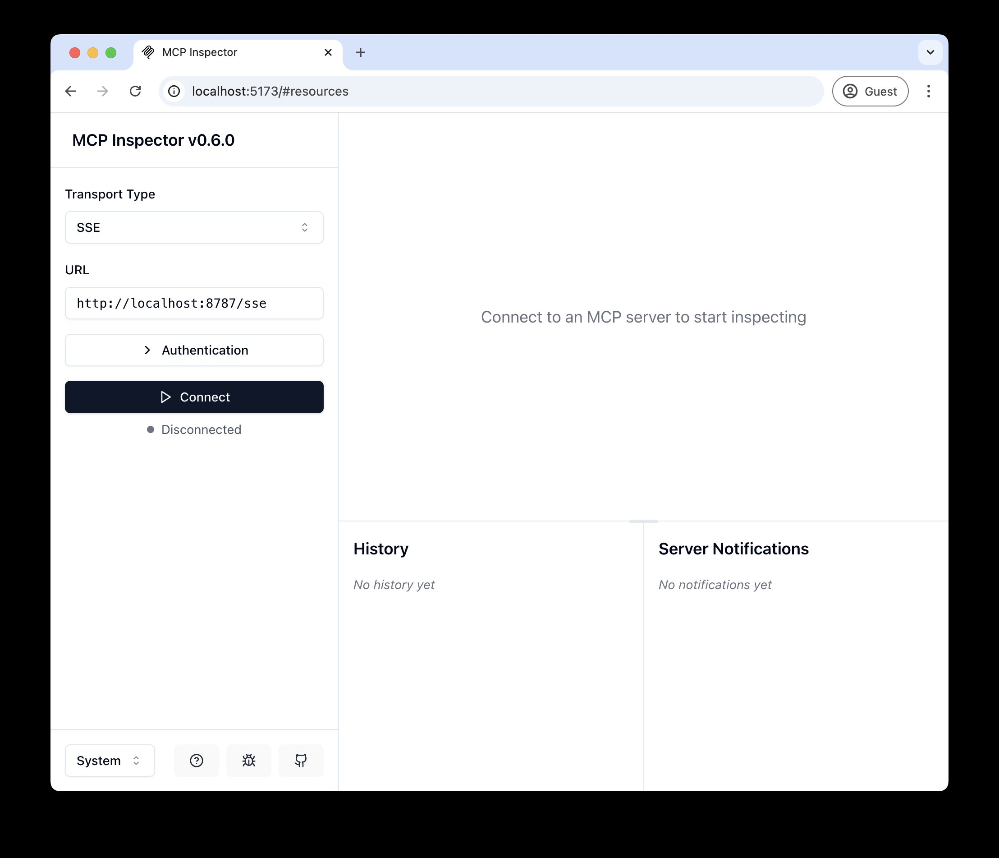

# Google Search Engine MCP Server

An MCP (Model Context Protocol) server based on Cloudflare Workers, providing Google search and webpage content extraction functionality with integrated OAuth login.

## Local Development

```bash
# Clone the repository
git clone https://github.com/your-username/google-search-engine-mcp-server.git

# Install dependencies
cd google-search-engine-mcp-server
npm install

# Run locally
npm run dev
```

Visit [`http://localhost:8787/`](http://localhost:8787/) to check the server status

## Connect to MCP Inspector Testing Tool

Use the [MCP Inspector](https://modelcontextprotocol.io/docs/tools/inspector) to explore and test the API:

- Run `npm run inspector` or `npx @modelcontextprotocol/inspector`
- In the Inspector interface, set the transport type to `SSE`, URL to `http://localhost:8787/sse`, and click "Connect"
- Enter any email and password in the mock login interface
- After logging in, you can view and call all available tools

<div align="center">
  
</div>

## Available Tools

This server provides the following tools:

1. **google_search** - Perform Google searches and return results
2. **extract_webpage_content** - Extract webpage content and convert it to readable text
3. **batch_extract_webpage_content** - Batch extract content from multiple webpages

## Connect to Claude Desktop

To connect Claude to your local MCP server:

1. Follow the [Anthropic Quick Start Guide](https://modelcontextprotocol.io/quickstart/user)
2. In Claude Desktop, go to Settings > Developer > Edit Config
3. Replace the existing content with the following configuration:

```json
{
  "mcpServers": {
    "google-search": {
      "command": "npx",
      "args": [
        "mcp-remote",
        "http://localhost:8787/sse"
      ]
    }
  }
}
```

After launching Claude, a browser window will open allowing you to log in. You can see available tools in the bottom right corner. With appropriate prompts, Claude will call the corresponding tools.

<div align="center">
  
</div>

## Deploy to Cloudflare

1. Create a KV namespace: `npx wrangler kv namespace create OAUTH_KV`
2. Follow the prompts to add the KV namespace ID to `wrangler.jsonc`
3. Set environment variables:
   - `GOOGLE_API_KEY` - Your Google API key
   - `GOOGLE_SEARCH_ENGINE_ID` - Your Google Custom Search Engine ID
4. Deploy: `npm run deploy`

## Connect to Remote MCP Server

After deployment, you can use MCP Inspector to connect to the remote server:

```bash
npx @modelcontextprotocol/inspector@latest
```

Enter your Workers URL (e.g., `your-worker-name.your-account.workers.dev/sse`) as the MCP server address and click "Connect".

## Connect Claude Desktop to Remote Server

Update the Claude configuration file to point to your Workers URL:

```json
{
  "mcpServers": {
    "google-search": {
      "command": "npx",
      "args": [
        "mcp-remote",
        "https://your-worker-name.your-account.workers.dev/sse"
      ]
    }
  }
}
```

## Troubleshooting

If you encounter issues:

1. Restart Claude
2. Try connecting to the MCP server directly from the command line:
   ```bash
   npx mcp-remote http://localhost:8787/sse
   ```
3. Clear the MCP authentication files:
   ```bash
   rm -rf ~/.mcp-auth
   ```
4. Check console logs for detailed error information

## Developer Notes

- This project is developed using TypeScript
- Based on Cloudflare Workers and Durable Objects
- Integrates OAuth authentication
- Uses Google Custom Search API for search functionality
- Includes webpage content extraction and analysis features